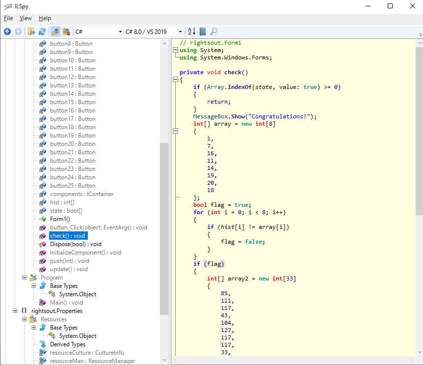
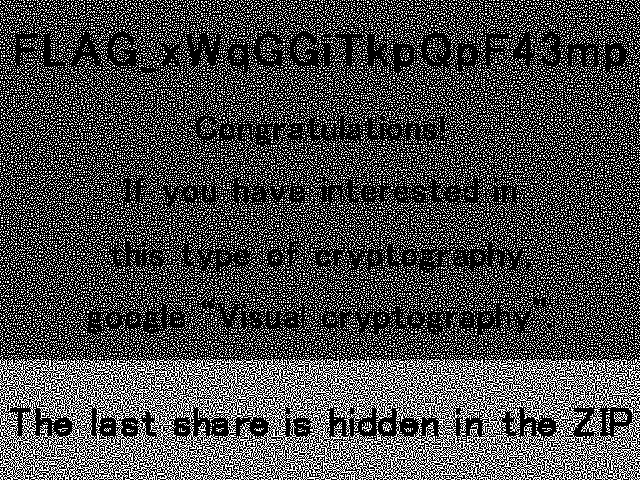

# ksnctf

write up です。ネタバレはいってます。

## 便利ツール

- ELFヘッダの解析用コマンド
    - readelf -r  Relocation Table 
	    リンクされているLibcの関数がわかる。
    - readelf -h  elf Header
	- readelf -S  Section Header Table
	- readelf -l  Program Header Table

- バイナリダンプ
    - objdump -D [filename]

- ツール群
	- Web IDE 
		https://ideone.com/

	- 数の帝国(素因数分解) 
		https://ja.numberempire.com/numberfactorizer.php

    - ファイル同定  
        https://mark0.net/onlinetrid.py

- お役立ちページリンク
    - Forensics入門（CTF）
    https://qiita.com/knqyf263/items/6ebf06e27be7c48aab2e

## Linux環境構築
### Ubuntu 16.04 へのAnaconda, Jupyter notebook
- Jupyter notebook 
    [Ubuntu 16.04.2 + Jupyter Notebook (+ bash_kernel + nbextensions](https://qiita.com/cafedrip/items/f944f72016ced4ff4361)
- Anaconda
    - インストールはGUIからできる。 
    [Anaconda 3 のインストール（Ubuntu 上）](https://www.kkaneko.jp/tools/ubuntu/anaconda.html)

    - アップデート 
    `conda update --prefix /home/kitagawa/anaconda3 anaconda`

## トピック
        
### javascript難読化

- [(」・ω・)」うー!(/・ω・)/にゃー!encode](https://kusano-k.hatenadiary.com/entry/20120421/1335006525)
  

- 0[] の文法 
  [Stack Overflow](https://stackoverflow.com/questions/18635387/advanced-syntax-0constructorconstructor-how-does-it-works-to-evalua)

## 問題メモ
        
### Q4 Villager A
- printf書式文字列攻撃。
    - `echo -e '\xf4\xf9\x49\x80 %x %x %x %x %x %x %x' | ./q4`
    - echo の '-e' は

### Q6 Login
- とりあえず SQLインジェクション
    - a' OR 1=1 --

### Q14 John

- ユーザ名とbase64っぽい文字列が並んでる。
    - linux の /etc/shadow のようだ。
      一番下の列が、$SHA512IsStrong$DictionaryIsHere.http//ksnctf.sweetduet.info/q/14/dicti0nary_8Th64ikELWEsZFrf.txt:15491:0:99999:7:::
      なので、指定されたファイルにアクセスするとDictionaryがダウンロードできる。
    - `curl http://ksnctf.sweetduet.info/q/14/dicti0nary_8Th64ikELWEsZFrf.txt > dictionary.txt` 
    : 足すのを忘れないよう。

- 辞書攻撃しろということらしい。
    - ユーザ名:$6$(salt)$(password)... の構成になってる。
    - salt を単語の前につけて base64 encode してHitしたものを探せばいいのかな。
    - と思ったがうまくいかず。末尾の == は要らないとか。

- crypt モジュールを使うと一発でパスワード文字列が出てくる。
    - がなぜかとっても重くてこれも断念。
- John the ripper を使うと一発。
    - `john --wordlist=dictionary.txt shadow.txt`  
      サイトによっては、`--wordlist==dictionary.txt` と書いてあり= が1個余計なことに注意。
    - `john --show passwd_shadow`  

### Q18 USB Flash Drive
- とりあえず
    - 7z で zipを展開すると、drive.img が出てくる。
    - 7z で drive.img を展開すると、更にファイルが3つ出てくる。.img は 7z で展開できるらしい。
    - ファイル3個。
        - Carl Larsson Brita as Iduna.jpg 
        - Mona Lisa.jpg
        - The Great Wave off Kanagawa.jpg
    - バイナリで覗く。
         ファイル名そのままは格納されてない。
        wikimedia へのリンクっぽくなってて、スペースがアンダースコアになってる。
         → ファイル名はUTF-16で入ってる。
        - Carl Larsson Brita as Iduna.jpg   (0x0055DD60)
        - Mona Lisa.jpg                     (0x001724D0)
        - The Great Wave off Kanagawa.jpg   (0x0055E990)

          Carl = "43 00 61 00 72 00..."
          Mona = "4D 00 6F 00 6E 00...."
          Kanagawa = "4B 00 61 00 6E 00..."
          それとは別にURLっぽいのもいる。
        - Carl Larsson Brita as Iduna.jpg   (みつからない)
        - Mona Lisa.jpg                     
        - The Great Wave off Kanagawa.jpg   (0x000CD000)
    - というのは、結局関係なかった。。。

- .img ファイルのファイルフォーマット
    - <a href="https://en.wikipedia.org/wiki/IMG_(file_format)">Wikipedia</a>

- .img ファイルを解凍。
      unzip image.zip
      7z x disk.img
      [DELETED] フォルダ以下に消されたファイルが出てくる。
        00から順に結合するとフラグが出てくる。

### Q24 LightsOut

- Cheat Engine でチーとして終わらせたけど Contratulations! って出るだけだった。
- ILSpyで逆コンパイルできる。
    
- この array2 の部分をC# として実行するとフラグが出てくる。
  IDEOne で標準出力に出すと出てきた。

### Q28 LowTechCipher

- zipファイルひとつ。
    - zipファイルを解凍すると2個のpngが出てくる。
    - とりあえず重ねる。paint で、イメージ > 選択 > 透明の選択 で背景を透明にできる。
      うにうに動かしてると、 "The last sha is hidden in the zip" が出てくる。(単に左上を基準に重ねればよし)
      上半分はただのごみ。

- zipファイルのフォーマット
    -  <a href = "https://ja.wikipedia.org/wiki/ZIP_(%E3%83%95%E3%82%A1%E3%82%A4%E3%83%AB%E3%83%95%E3%82%A9%E3%83%BC%E3%83%9E%E3%83%83%E3%83%88)">wikipedia</a>
    - 末尾にある「セントラルディレクトリ」にファイル情報が格納されている。
      ファイルの実体は先頭から。 
      先頭からは解釈できない構造らしい。

- バイナリで眺める。
    - セントラルディレクトリには各ファイルの zip ファイル先頭からのオフセット、ファイル名などんが
        格納されている。
    - エントリが2個あり解凍されたファイルと対応する。
        ひとつは 0x00017418、もうひとつは 0x0002E134。
        オフセットをながめるとそれぞれ .png ファイルのフォーマットになっている。
    - ファイルの先頭付近は png ファイルのフォーマットなのだが、このエントリがない。

- 0x00000000 - 0x00017418 に入ってる、あと1個のファイルを取り出す。
    - セントラルディレクトリを書き換えてオフセットを 0x00000000 にしてみたが、
        7-zipは解凍してくれなかった。
    - 単にバイナリを切り出せばいいので、python でソースを書いて切り出した。
        取り出したら、そりゃ重ねますよねー。
    - </img>

    
        
